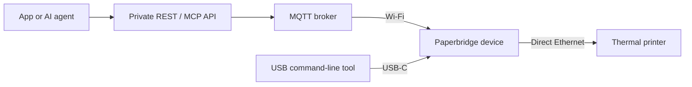

# Paperbridge

**Send something real to someone far away.**

[](https://github.com/giuseppecrj/paperbridge/actions/workflows/ci.yml)
[](LICENSE)

Paperbridge turns a connected thermal printer into a **physical inbox** for
notes, pictures, and updates from people, applications, and AI agents. The
recipient gets something on paper without having to open an app.

Imagine a note from your daughter arriving in the kitchen, or your appointments
and the weather waiting for you each morning. That is the experience we are
building toward. Today, this repository contains the device firmware, print
protocol, developer tools, and private API that make the paper delivery path work.

> **Early development.** USB, REST, and MCP printing have been demonstrated on
> the reference hardware. A consumer app, pairing, sender permissions, and
> scheduling are still ahead. The 72-hour hardware reliability soak is also
> outstanding; Paperbridge is not yet a finished consumer product.

[Get started](#get-started) · [How it works](#how-it-works) ·
[Hardware setup](#connect-a-printer) · [API and AI agents](#connect-an-app-or-agent) ·
[Documentation](#documentation)

## A physical inbox

The [product vision](docs/product.md) is a printer you pair once and place
somewhere in your home. You choose who can send to it: family, friends, an app,
or an AI agent. A short note arrives on paper; a QR code can point to the photos
or other content behind it.

For example, a future morning update could look like this:

```text
GOOD MORNING, DAD

It will be sunny today. High: 71 F

10:30  Doctor appointment
 3:00  Call with Giuseppe

Ava says:
"We found a new apartment.
Call us when you wake up."

[QR: View photos]
```

This is an example of the intended experience. Automatic morning updates,
invitations, and phone-based setup are product work still to come.

## What works today

| Capability | Current scope |
| --- | --- |
| Send from your computer | USB command-line tools submit print jobs and inspect the device. |
| Connect an app or AI agent | A private REST API and MCP tool send jobs to one configured device over MQTT. |
| Compose a receipt | Bounded ASCII text, alignment and emphasis, rules, QR codes, paper feed, and an explicitly authorized partial cut. |
| Include an image | REST and MCP prepare PNG/JPEG images as monochrome rasters up to 576 × 576 pixels. PNG output has been observed on hardware; broader image-quality acceptance remains. |
| Develop without a printer | Host tests and a TCP printer simulator exercise the software delivery path. |

The reference setup is a **Waveshare ESP32-S3-ETH** running MicroPython and a
**Rongta RP326** thermal printer. USB, private REST/MQTT, and MCP paths have
produced operator-confirmed paper output on that setup. Compatibility with other
boards and printers needs separate validation. The
[hardware record](docs/hardware.md) distinguishes purchased-unit observations
from documented specifications.

Jobs currently require an online device. Duplicate suppression lasts for one
boot; durable delivery, automatic retries, multi-device routing, and over-the-air
updates are not implemented. The private API has no public application
authentication and must remain behind access control. Recent security hardening
still has a separate [deployment and hardware acceptance gate](https://github.com/giuseppecrj/paperbridge/issues/82).

## How it works



The device receives a structured print job, converts its content into printer
commands, and sends them to the printer over its dedicated Ethernet connection.
The computer does not need a direct network route to the printer.

A result of `delivered_to_printer` means all bytes reached the printer-facing
socket. It does not confirm that paper emerged. A timeout returns `unknown` and
does not automatically resend the job. See the [architecture](docs/architecture.md)
and [print-job protocol](docs/protocol.md) for the delivery contract.

## Get started

You can explore the code and run the ordinary checks without a printer, device,
or 1Password account. Install [mise](https://mise.jdx.dev/), then clone the
repository and set up the pinned toolchain:

```sh
git clone https://github.com/giuseppecrj/paperbridge.git
cd paperbridge
mise trust
mise install
mise exec -- just bootstrap
mise exec -- just lint
mise exec -- just format-check
mise exec -- just test
```

These tests do not open a serial port or operate a printer. They cover the Python
firmware logic and CLI, TypeScript protocol and API, and simulator paths. Tests
that need a local MQTT broker run when `mosquitto` and `mosquitto_passwd` are
installed; otherwise they are reported as skipped. Docker container acceptance
is a separate gate described in [Testing](docs/testing.md).

[mise.toml](mise.toml), [uv.lock](uv.lock), and [bun.lock](bun.lock) pin the
project's tools and dependencies. With mise activated in your shell, you can
use the shorter `just` commands shown throughout the documentation.

Intel Macs support the CLI, host tests, and `mpremote`, but erase and flash
operations require Apple Silicon macOS or Linux. The development environment
excludes `esptool` on Intel macOS because patched `cryptography` versions no
longer support it. Do not downgrade to a vulnerable version to restore flashing.

### Connect a printer

Start with the [local bring-up guide](docs/local-bringup.md),
[hardware requirements](docs/hardware.md), and
[network topology](docs/network-topology.md). Follow the guide's order: identify
the board and port, verify the firmware, configure networking, check reachability,
then test text, feed, and an explicit cut last. Power the printer from its own
24 V adapter and the board from USB.

Networked development uses non-secret settings in ignored `.env` and credentials
provided by Fnox through 1Password. The checked-in references are project-specific;
set up your own mappings using the [secrets workflow](docs/research/fnox-secrets-workflow.md).
Generate the ignored device configuration with `just configure-device` rather
than editing it by hand. Never commit `.env`, credentials, or generated
`firmware/micropython/config.json`.

<details>
<summary>Reference board: firmware download and flash commands</summary>

Read [MicroPython bring-up](docs/micropython-bringup.md) before running these
commands. The selected image is for the verified ESP32-S3 with 16 MB flash and
8 MB octal PSRAM; inspect your board before choosing it. Use a USB-C data cable
and select the exact port reported by `just ports`:

```sh
just ports
# Replace this example with your board's actual port.
export PAPERBRIDGE_PORT=/dev/cu.usbmodem101

mkdir -p firmware/downloads
curl -fL \
  'https://micropython.org/resources/firmware/'\
'ESP32_GENERIC_S3-SPIRAM_OCT-20260406-v1.28.0.bin' \
  -o firmware/downloads/ESP32_GENERIC_S3-SPIRAM_OCT-20260406-v1.28.0.bin
printf '%s  %s\n' \
  67c19ae123d84152019b57526ed5291dd0a2b4edd87655c5f76b46c9a62ff5dd \
  firmware/downloads/ESP32_GENERIC_S3-SPIRAM_OCT-20260406-v1.28.0.bin \
  | shasum -a 256 -c -
```

The next commands erase the selected board and install MicroPython. Continue
only after the checksum passes and you have confirmed the board and port:

```sh
PORT="$PAPERBRIDGE_PORT" CONFIRM=erase just erase-device
PORT="$PAPERBRIDGE_PORT" \
FIRMWARE=firmware/downloads/ESP32_GENERIC_S3-SPIRAM_OCT-20260406-v1.28.0.bin \
  just flash-micropython
PORT="$PAPERBRIDGE_PORT" just repl
PORT="$PAPERBRIDGE_PORT" just verify-board
```

Exit the REPL before verifying the board. Return to the
[local bring-up guide](docs/local-bringup.md) for configuration, application
firmware deployment, and printer checks.

</details>

### Connect an app or agent

The [API guide](apps/api/README.md) covers local setup, request examples, limits,
and errors. Configure an [authenticated local MQTT broker](tools/mosquitto/README.md)
and device before starting the API with `just api`.

- **REST:** `POST http://127.0.0.1:3000/api/jobs` accepts a complete `print-job.v1`.
- **MCP:** `http://127.0.0.1:3000/mcp` exposes `paperbridge_print`, which accepts
  receipt content and supplies the job identity for you.

Both use the same validation and delivery path. Keep the service bound to
loopback; remote access requires a private, authenticated proxy. The
[private access guide](docs/private-cloud-access.md) documents the existing
operator deployment. Publishing this repository does not make that API public.

## Documentation

| Start here | What you will find |
| --- | --- |
| [Product](docs/product.md) and [domain language](CONTEXT.md) | Intended recipient experience and shared vocabulary. |
| [Architecture](docs/architecture.md) and [decisions](docs/adr/) | Runtime design, delivery boundaries, and future migration gates. |
| [Print-job protocol](docs/protocol.md) and [USB RPC](docs/usb-serial-rpc.md) | Receipt blocks, result semantics, and device commands. |
| [Local bring-up](docs/local-bringup.md) and [troubleshooting](docs/troubleshooting.md) | Board setup, network checks, and recovery. |
| [Testing](docs/testing.md) and [hardware evidence](docs/hardware.md) | Automated checks, physical acceptance, and the outstanding soak. |
| [Security](docs/security.md) | Trust boundaries, secrets handling, and rollout requirements. |

The main code lives in [firmware/micropython](firmware/micropython/),
[tools/device-cli](tools/device-cli/), [apps/api](apps/api/), and
[packages/protocol](packages/protocol/). The
[printer simulator](tools/printer-simulator/) provides the TCP test endpoint.

## Contributing

Use [GitHub Issues](https://github.com/giuseppecrj/paperbridge/issues) to find
planned work or discuss a change. For a bug report, include the relevant software
version, hardware model when applicable, steps to reproduce, and redacted output.
Keep credentials out of issues and logs.

Read [AGENTS.md](AGENTS.md) for project conventions. Run `just lint`,
`just format-check`, and `just test` before submitting changes; changes to the API
image or runtime boundary also need `just test-api-container`. Record physical
observations separately from host-test results. Run `just secrets-scan` before
sharing commits; it scans committed history with redacted findings, not ignored
files or uncommitted changes.

Paperbridge is available under the [MIT License](LICENSE).
