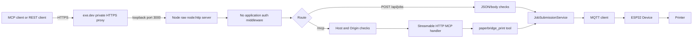
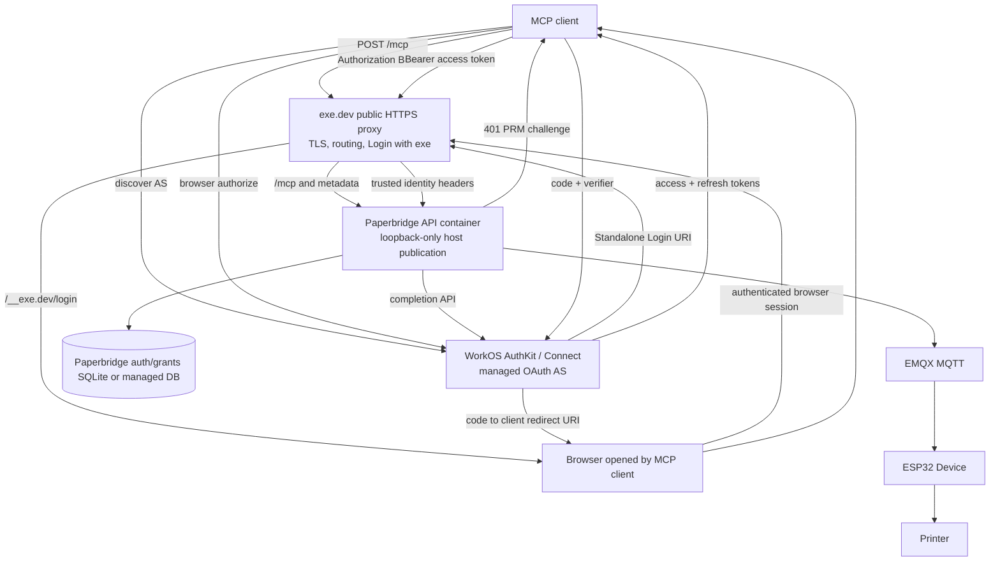
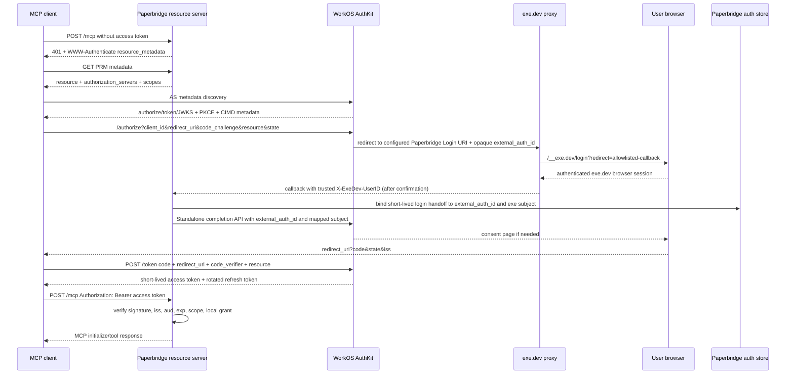
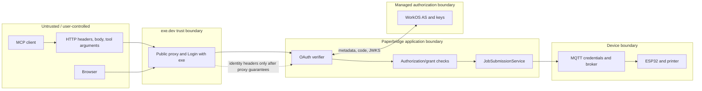

# Paperbridge MCP OAuth migration proposal

**Research date:** 2026-08-15  
**Status:** Proposal only. No runtime or deployment changes were made.  
**Decision owner:** Paperbridge Owner

## Executive summary

The repository does **not** currently implement application authentication in
Node. The current protection is an exe.dev private proxy and its
`X-Exedev-Authorization` edge credential. The Node process does not read that
header, and no `X-ExeDev-*` identity header is used in application code. This is
important: the repository state is less advanced than the premise suggests.

The safest target is:

- **Human authentication:** exe.dev Login with exe, but only as an upstream
  browser authentication step and only after exe.dev confirms its injected
  identity-header trust guarantees.
- **Authorization server:** a managed MCP-capable OAuth provider. The best
  documented fit found is **WorkOS AuthKit / Connect Standalone MCP Auth**. It
  supplies the OAuth authorization-code/token/refresh machinery, MCP metadata,
  Client ID Metadata Document support, resource indicators, consent, and key
  management. Paperbridge remains responsible for mapping an authenticated
  WorkOS subject to local Senders, Invites, Devices, and Printers.
- **MCP resource server:** `apps/api` validates WorkOS-signed bearer access
  tokens at the HTTP boundary before the MCP handler, checks issuer, audience,
  expiry, and scopes, and passes a normalized principal to the tool layer.
- **Legacy migration:** keep the current private exe.dev VM-token path on the
  existing private hostname during migration. Do not treat the VM token as a
  Paperbridge Sender identity. A separate legacy hostname is safer than trusting
  unverified `X-ExeDev-*` headers on a public OAuth hostname.

This is **not ready for OAuth implementation yet**. Two external facts must be
confirmed first:

1. exe.dev must confirm that Login with exe is usable on a public share and that
   user-controlled copies of `X-ExeDev-UserID` and `X-ExeDev-Email` are stripped
   or overwritten before the application sees them; and
2. WorkOS must confirm the selected environment's MCP features, token claims,
   resource-indicator behavior, refresh/revocation behavior, and billing/data
   requirements.

The smallest safe first pull request is a **behavior-preserving principal
abstraction and request-auth seam**, with tests. It must not publish OAuth
metadata, return OAuth challenges, change exe.dev visibility, or remove the
existing private edge path.

## 1. Current-state assessment

### 1.1 Repository facts

| Concern | Current implementation | Evidence |
| --- | --- | --- |
| Runtime | Node `26.3.0`; production image is Node 26.3.0 | `mise.toml`; `apps/api/Dockerfile` |
| Package manager | Bun `1.3.14`; workspace lockfile `bun.lock` | `package.json`, `mise.toml` |
| Language | TypeScript, NodeNext, strict mode | `apps/api/tsconfig.json` |
| HTTP framework | Raw `node:http`; no Express/Fastify/Hono/Nest | `apps/api/src/api-server.ts:1-6` |
| MCP SDK | `@modelcontextprotocol/server`, `@modelcontextprotocol/node`, and test client `2.0.0` | `apps/api/package.json:14-24`, `bun.lock` |
| MCP transport | Streamable HTTP through `createMcpHandler` and `toNodeHandler`; no legacy HTTP+SSE endpoint | `apps/api/src/mcp-server.ts:93-140` |
| MCP endpoint | `/mcp` | `apps/api/src/api-server.ts:78-80` |
| REST endpoint | `POST /api/jobs` | `apps/api/src/api-server.ts:82-111` |
| Local port | `127.0.0.1:3000` by default | `apps/api/src/server.ts:18-19` |
| Deployed port | Container port 3000, published by Docker as host `127.0.0.1:3000` | `deploy/exedev/paperbridge-container.service:15-23` |
| Public origin | `https://api.paperbridge.tech` | `docs/private-cloud-access.md:12-17`, deployment env template |
| Current edge | Private exe.dev HTTPS proxy; finite VM token in `X-Exedev-Authorization` | `docs/private-cloud-access.md:19-34` |
| Persistence | No API database, user table, auth-session store, or permission store | `apps/api/package.json`, `apps/api/src`, deployment files |
| Secrets | Fnox/1Password locally; encrypted systemd credential for MQTT in deployment | `fnox.toml`, `docs/research/fnox-secrets-workflow.md`, `deploy/exedev/paperbridge-container.service` |
| Deployment | Hardened Docker container supervised by systemd; historical direct-Node service is retired | `deploy/exedev/paperbridge-container.service`, `docs/exedev-container-deployment.md` |

No secret, token, cookie, private key, or environment value is reproduced here.

### 1.2 Existing request path



The current exe.dev VM token is consumed by the edge according to the checked-in
runbook. It is not a Paperbridge API key, Sender identity, Invite, or scoped
permission. The application should never forward it to MQTT or downstream
services.

### 1.3 Authentication and request handling

- `createApiServer()` dispatches `/health`, `/ready`, `/mcp`, and
  `/api/jobs`. There is no bearer-token or identity middleware in
  `apps/api/src/api-server.ts:62-129`.
- `/api/jobs` parses and submits a valid JSON body without checking `Host`,
  `Origin`, or any application credential.
- `createMcpEndpoint()` runs the SDK handler only after
  `hostHeaderValidation()` and the local `originIsAllowed()` check
  (`apps/api/src/mcp-server.ts:73-88, 126-137`). It does **not** verify
  authentication. The v2 SDK also documents `requireBearerAuth` and
  `mcpAuthMetadataRouter`; use those as references if their API matches the
  pinned `2.0.0` package, rather than copying `main`-branch code blindly.
- The MCP tool generates the `job_id`, configured `device_id`, and timestamp
  server-side (`apps/api/src/mcp-server.ts:103-115`). That is a useful future
  authorization seam: a caller cannot select another configured device through
  the current MCP tool.
- `server.ts` composes the broker, job service, MCP endpoint, and HTTP server;
  no principal is created or passed (`apps/api/src/server.ts:38-53`).
- `env.ts` validates the configured allowed host and HTTPS origin but has no auth
  settings (`apps/api/src/env.ts:69-103`).

### 1.4 Security controls already present

- Body limits and JSON parsing precede submission
  (`apps/api/src/api-server.ts:40-53, 103-110`).
- The semantic schema rejects raw ESC/POS and unsupported content. The job service
  checks the configured device.
- MCP Host validation and Origin validation defend against DNS rebinding for
  the MCP route. Missing Origin is deliberately allowed for non-browser MCP
  clients (`apps/api/src/mcp-server.ts:73-88`).
- The production container is non-root, read-only, capability-free, and only
  published to host loopback (`deploy/exedev/paperbridge-container.service:15-23`).
- There is no application rate limiter, request audit identity, OAuth state
  store, user/grant persistence, or secret-safe structured request logging.

### 1.5 Current risks and technical debt

1. If the exe.dev proxy becomes public or is bypassed, `/api/jobs` and `/mcp`
   have no application authentication.
2. A VM token holder has undifferentiated access to the private service; there is
   no per-Sender revocation or authorization.
3. Trusting `X-ExeDev-UserID` or `X-ExeDev-Email` is unsafe until direct-port
   exposure, proxy overwrite/stripping, and public-share behavior are confirmed.
4. The code has no principal abstraction. Tool authorization cannot yet be
   applied consistently to REST and MCP.
5. There is no durable place to store OAuth login handoffs, Paperbridge users,
   grants, refresh-token audit records, or revocations.
6. Current tests cover transport and Host/Origin behavior, but not authentication
   or cross-user authorization (`apps/api/tests/api-server.test.ts`,
   `apps/api/tests/mcp-server.test.ts`).

## 2. Standards research

### 2.1 MCP version and transport posture

The repository pins SDK packages at `2.0.0`, while the installed test client
pins a protocol version in `apps/api/tests/mcp-server.test.ts`. The proposal
uses the current MCP authorization and Streamable HTTP requirements, with
compatibility testing against the protocol versions supported by SDK 2.0.0.
MCP specification pages are versioned; do not silently copy draft behavior into
production without pinning the selected revision.

Primary sources:

- [MCP 2025-11-25 authorization](https://modelcontextprotocol.io/specification/2025-11-25/basic/authorization)
- [MCP 2026-07-28 authorization](https://modelcontextprotocol.io/specification/2026-07-28/basic/authorization)
- [MCP 2025-11-25 transports](https://modelcontextprotocol.io/specification/2025-11-25/basic/transports)
- [MCP 2026-07-28 Streamable HTTP](https://modelcontextprotocol.io/specification/2026-07-28/basic/transports/streamable-http)
- [MCP security best practices](https://modelcontextprotocol.io/specification/2025-11-25/basic/security_best_practices)
- [MCP TypeScript SDK HTTP serving](https://ts.sdk.modelcontextprotocol.io/v2/serving/http.html)
- [MCP TypeScript SDK authorization serving](https://ts.sdk.modelcontextprotocol.io/v2/serving/authorization.md)
- [MCP TypeScript SDK OAuth examples](https://github.com/modelcontextprotocol/typescript-sdk/tree/main/examples/oauth)

Normative consequences for this service:

- HTTP authorization is optional in MCP, but a protected HTTP server should
  implement the MCP authorization profile.
- A protected MCP server is an OAuth resource server. The authorization server
  may be separate.
- Streamable HTTP requires Origin validation; invalid Origin is `403`.
- Access tokens must be sent in `Authorization: Bearer ...` on every MCP HTTP
  request and must not be placed in a query parameter.
- Protected Resource Metadata (PRM, RFC 9728) is required for protected MCP
  servers. The response must identify at least one authorization server.
- A missing or invalid token is `401`; insufficient scope is `403`.
- The resource server must validate that the token is intended for this MCP
  resource. It must not accept or pass through a token issued for another API.
- MCP clients must use the OAuth `resource` parameter in both authorization and
  token requests, using the canonical MCP resource URI.
- PKCE is required for the public-client authorization-code flow; clients use
  `S256` when capable.
- Current MCP guidance favors Client ID Metadata Documents (CIMD). The active
  IETF CIMD draft is currently `-02` (published 2026-07-06); MCP pages still
  reference `-00`, so provider/client interoperability must be tested. Dynamic
  Client Registration (DCR, RFC 7591) remains an optional compatibility
  fallback in the 2025-11-25 and 2026-07-28 specifications; the 2026-07-28
  changelog explicitly deprecates DCR for new deployments.
- Clients must validate authorization-server issuer metadata and should validate
  the authorization response issuer (`iss`) when advertised.
- Refresh tokens are not guaranteed by MCP. If issued to public clients, the AS
  should rotate them and detect reuse.

### 2.2 OAuth and HTTP standards used

| Standard | Design use | Primary source |
| --- | --- | --- |
| OAuth 2.1 | Authorization Code with PKCE, no implicit/password grants | [IETF OAuth 2.1 draft](https://datatracker.ietf.org/doc/html/draft-ietf-oauth-v2-1-13) |
| RFC 6750 | `Authorization` bearer syntax and `WWW-Authenticate` errors | [RFC 6750](https://www.rfc-editor.org/rfc/rfc6750) |
| RFC 7636 | PKCE; require `S256` | [RFC 7636](https://www.rfc-editor.org/rfc/rfc7636) |
| RFC 8414 | Authorization Server Metadata | [RFC 8414](https://www.rfc-editor.org/rfc/rfc8414) |
| RFC 8707 | Resource Indicators and audience binding | [RFC 8707](https://www.rfc-editor.org/rfc/rfc8707) |
| RFC 9728 | Protected Resource Metadata and `resource_metadata` challenge | [RFC 9728](https://www.rfc-editor.org/rfc/rfc9728) |
| RFC 9207 | Authorization-server issuer response parameter | [RFC 9207](https://www.rfc-editor.org/rfc/rfc9207) |
| CIMD draft | HTTPS URL client identifiers for unknown MCP clients | [OAuth Client ID Metadata Document draft](https://datatracker.ietf.org/doc/html/draft-ietf-oauth-client-id-metadata-document-00) |
| RFC 7591 | Legacy/compatibility dynamic registration | [RFC 7591](https://www.rfc-editor.org/rfc/rfc7591) |

These are protocol requirements or standards facts. Provider behavior and MCP
client behavior below are separate implementation compatibility claims.

### 2.3 exe.dev findings

The repository's previous primary-source research is in
[`docs/research/exedev-oidc-integration-2026-08-07.md`](exedev-oidc-integration-2026-08-07.md).
The official sources are:

- [Login with exe](https://exe.dev/docs/login-with-exe)
- [exe.dev proxy](https://exe.dev/docs/proxy)
- [Sharing](https://exe.dev/docs/sharing)
- [HTTPS tokens for VMs](https://exe.dev/docs/https-tokens-for-vms)
- [exe.dev HTTPS API](https://exe.dev/docs/https-api)

Documented conclusions:

- Login with exe is a browser/proxy login feature. It redirects through
  `/__exe.dev/login`, uses an exe.dev session cookie, and makes identity headers
  available to the proxied application.
- The documented identity headers are `X-ExeDev-UserID` and
  `X-ExeDev-Email`. They are not documented as OAuth access tokens.
- exe.dev documents VM-scoped HTTPS credentials for non-browser clients. The
  preferred header is `X-Exedev-Authorization`; the proxy consumes it. This is
  an exe.dev edge credential, not an OAuth token for Paperbridge.
- exe.dev's public OIDC discovery is minimal and does not document the complete
  authorization-code/token/registration surface required for an MCP AS. The
  Login with exe URL must not be treated as an MCP authorization endpoint.
- A public share is necessary for anonymous MCP discovery and machine-to-machine
  token requests not to be intercepted by private-site login. The application,
  not the edge login page, must return OAuth `401` and metadata.
- The application must remain unreachable except through the proxy. The current
  container service publishes host loopback only.
- The docs do not provide a contractual guarantee in the repository that an
  attacker-supplied `X-ExeDev-UserID` or `X-ExeDev-Email` is stripped or
  overwritten. This is a blocker for using those headers as the only identity
  proof on a public share. Ask exe.dev support for an explicit answer and test a
  no-output staging route.

### 2.4 Provider research

**WorkOS AuthKit / Connect** is the leading managed candidate because its
first-party MCP guide explicitly documents the needed integration rather than
requiring inference from generic OIDC features:

- [WorkOS MCP authentication](https://workos.com/docs/authkit/mcp)
- [Standalone Connect](https://workos.com/docs/authkit/connect/standalone)
- [OAuth token verification](https://workos.com/docs/authkit/connect/oauth/verifying-tokens)
- [OAuth application and public PKCE clients](https://workos.com/docs/authkit/connect/oauth)

The WorkOS MCP guide documents PRM, resource-indicator configuration, audience
claims, CIMD enablement, optional DCR compatibility, and JWT verification with
JWKS. Standalone Connect documents a Login URI: AuthKit redirects to the
application, the application authenticates with its existing system, calls the
completion API, and AuthKit resumes consent and token issuance. This matches the
desired division of labor if exe.dev is accepted as the upstream human login.

WorkOS also documents public applications using PKCE and says access tokens can
be locally verified with its JWKS; it documents introspection as an alternative
when synchronous validity checks are needed.

Auth0 is a viable generic managed fallback: its official docs document
authorization-code PKCE, refresh-token rotation/reuse detection, and DCR. The
MCP-specific PRM/resource-indicator integration would require additional
provider verification and configuration, so it is not the first choice merely
because it is a mature OIDC provider:

- [Auth0 PKCE](https://auth0.com/docs/get-started/authentication-and-authorization-flow/authorization-code-flow-with-pkce)
- [Auth0 refresh rotation](https://auth0.com/docs/secure/tokens/refresh-tokens/refresh-token-rotation)
- [Auth0 DCR](https://auth0.com/docs/get-started/applications/dynamic-client-registration)

Do not select a provider until a live tenant's metadata is checked for
`code_challenge_methods_supported: ["S256"]`, authorization-code and refresh
support, resource indicators/audience behavior, CIMD or DCR, JWKS, and revocation
semantics. Generic OIDC discovery alone is insufficient.

## 3. Client compatibility matrix

Compatibility must be verified with the current product build and a real
provider tenant. Product documentation changes frequently; the matrix records
what is documented or reasonably observable, not an acceptance claim.

| Client | Remote HTTP transport | Interactive OAuth | Discovery/registration evidence | Custom legacy headers | Status for Paperbridge |
| --- | --- | --- | --- | --- | --- |
| ChatGPT custom connectors/developer mode | OpenAI documents public HTTPS remote Streamable HTTP (and HTTP/SSE for remote MCP tools) | OpenAI plugin authentication docs explicitly describe OAuth 2.1, CIMD/DCR/pre-registration, PKCE/S256, resource echoing, and bearer tokens | Test the actual ChatGPT tenant and callback; account/plan availability is not a repository fact | Custom API keys are not the documented OAuth path | **Required pilot; verify in target tenant** |
| Claude remote MCP/custom integrations | Anthropic documents public HTTPS Streamable HTTP and SSE for its MCP connector | Connector docs describe OAuth bearer use with a pre-obtained token; direct connector API handles OAuth/refresh outside the request | Tools-only connector and beta/product limits apply | Do not assume arbitrary custom headers | **Pilot only; verify** |
| Cursor | Docs explicitly list stdio, SSE, and Streamable HTTP | Docs explicitly mention remote OAuth, static OAuth client credentials, and fixed callback URLs | Test PRM, resource, PKCE, CIMD/DCR, and refresh in the target build | Arbitrary headers and env interpolation are documented | **Good early test client** |
| VS Code / GitHub Copilot | Official docs document remote HTTP MCP configuration; the page does not document OAuth details | OAuth/CIMD/DCR behavior is unknown from the cited page | Verify current discovery and registration implementation | Headers may be configurable in local `mcp.json`, but not assumed for managed users | **Test, do not promise** |
| Codex | OpenAI documents Streamable HTTP, bearer/OAuth, static headers, and CLI login | Current Codex source shows CIMD when advertised, DCR fallback, PKCE, resource, and issuer-validation tests | Source evidence is revision-specific; test the released binary | Static headers are available for migration only | **Strong early test client** |
| MCP Inspector | Official Inspector supports Streamable HTTP and OAuth troubleshooting | Inspector docs describe 401/PRM discovery, pre-registration/CIMD/DCR, browser callback, persisted tokens, and step-up reauth | Suitable for PRM, AS metadata, PKCE, and token tests | Can send custom headers for legacy testing | **Required manual acceptance client** |
| Repository test client | `@modelcontextprotocol/client@2.0.0` and `StreamableHTTPClientTransport` | OAuth not currently exercised in repository tests | Local transport only today | Test harness can add controlled headers | **Automated regression client** |
| Pi MCP adapter | Existing project research confirms URL-based Streamable HTTP and arbitrary headers; current adapter also has OAuth configuration | Verify installed adapter version against current MCP spec | Test PRM/401 and provider flow in the installed adapter | Existing private config uses `X-Exedev-Authorization` | **Required migration client** |

Primary client references:

- [OpenAI MCP extension and OAuth](https://learn.chatgpt.com/docs/extend/mcp.md)
- [OpenAI plugin authentication](https://developers.openai.com/plugins/build/auth.md)
- [OpenAI remote MCP tools](https://platform.openai.com/docs/guides/tools-connectors-mcp.md)
- [Anthropic MCP connector](https://platform.claude.com/docs/en/agents-and-tools/mcp-connector.md)
- [Cursor MCP documentation](https://cursor.com/docs/mcp.md)
- [VS Code MCP servers](https://code.visualstudio.com/docs/copilot/chat/mcp-servers)
- [Codex MCP configuration](https://learn.chatgpt.com/docs/extend/mcp.md)
- [Codex client registration source](https://github.com/openai/codex/blob/main/codex-rs/rmcp-client/src/oauth_client_registration.rs)
- [MCP Inspector authorization](https://modelcontextprotocol.io/docs/2026-07-28/tools/inspector/authorization.md)
- [MCP Inspector repository](https://github.com/modelcontextprotocol/inspector)
- [MCP TypeScript client transport API](https://ts.sdk.modelcontextprotocol.io/v2/api/@modelcontextprotocol/client/client/streamableHttp.html)

Unknown client behavior is a release gate, not a reason to weaken the server.
The server should implement the standard surface and document client-specific
workarounds separately.

## 4. Options comparison

| Option | Compatibility | Operations | Identity and permissions | Main security concern | Decision |
| --- | --- | --- | --- | --- | --- |
| A. Managed MCP-capable AS (WorkOS) | Best documented MCP fit; PKCE, CIMD, DCR fallback, PRM/resource indicators, JWKS | Low application burden; provider cost and vendor dependency | WorkOS `sub` plus local user/grant mapping; standalone login can use existing auth | Provider configuration drift; need provider confirmation | **Recommend** |
| B. Self-hosted AS beside API | Can be standards-compliant if carefully configured | High: DB, keys, consent, codes, sessions, rotation, patches, router | Full control | Hand-written or incomplete OAuth is a severe risk; operational failure | Do not choose for first implementation |
| C. Login with exe as AS/upstream | Login with exe alone is not an MCP AS and has no documented token endpoint | Low only if undocumented behavior is assumed | Header identity could map to local user | Header spoofing/overwrite, CSRF, state, code handling, no standard discovery | **Reject alone; use only behind managed AS if confirmed** |
| D. Transitional API keys | Works with any client supporting static headers | Low, but key lifecycle is application work | Per-key subject/scopes can be implemented | Long-lived bearer secrets and poor browser UX | Keep only as controlled migration fallback |

### Why not self-host OAuth now

A Node OAuth library such as an OAuth client library is not an authorization
server. A self-hosted AS would need an established, maintained server product,
not hand-written protocol endpoints, plus persistent storage for users,
consent, codes, refresh-token families, revocation, and signing keys. It would
also need an internal router because the active deployment has one public port.
This is more moving parts than the current single-device product justifies.

## 5. Recommended target architecture

### 5.1 Component responsibilities

| Component | Owns | Does not own |
| --- | --- | --- |
| exe.dev | TLS termination, public routing, optional edge access, browser Login with exe | Paperbridge OAuth tokens, scopes, or printer authorization |
| Login bridge in Paperbridge | Redirect to exe login, validate trusted proxy identity, call managed-AS completion API | OAuth code/token/refresh protocol |
| WorkOS AuthKit / Connect | OAuth authorization endpoint, consent, authorization code, token and refresh endpoints, JWKS, provider revocation/introspection | Paperbridge Device/Printer grants |
| MCP client | PRM/AS discovery, PKCE/state, secure token storage, bearer requests | Local Paperbridge permissions |
| `apps/api` resource server | Bearer verification, PRM, `WWW-Authenticate`, issuer/audience/scope checks, normalized principal | Issuing tokens or trusting email as a subject |
| Paperbridge authorization layer | User mapping, Sender/Owner/Invite grants, Device/Printer resource checks, audit records | Human password or email verification |
| MQTT/device path | Existing server-to-device delivery contract | MCP access tokens or Sender authorization |

### 5.2 Deployment topology



One public exe.dev port routes `/mcp`, both PRM paths, `/health`, `/ready`, and
the Login bridge. WorkOS authorization and token endpoints remain on the
provider's public origin. No second process is required on the VM for the
recommended option.

### 5.3 OAuth authorization-code sequence



The login bridge must not accept a client-supplied final redirect URL. It stores
or signs only the provider-issued opaque handoff and a fixed allowlisted return
path. The OAuth client's `state` remains client-owned and is returned unchanged
by the AS; the bridge must not replace it or expose it to an open redirect.

### 5.4 Trust boundaries



Never treat a browser cookie, email, tool argument, or unchecked identity header
as an access token. Never pass the MCP bearer token to MQTT or the printer.

## 6. Required OAuth surface

Assumed final resource origin: `https://api.paperbridge.tech`. If a new OAuth
hostname is selected, replace it consistently everywhere; do not derive it from
an arbitrary request Host header.

### 6.1 Endpoint ownership

| Endpoint | Owner | Public? | Request/response and authentication |
| --- | --- | --- | --- |
| `/mcp` | Paperbridge | Yes, at the public edge | Streamable HTTP POST/optional GET. Requires `Authorization: Bearer`. Missing/invalid token: `401`; valid token with missing grant: `403`. |
| `/.well-known/oauth-protected-resource` | Paperbridge | Yes | `GET`, JSON PRM. No user session or bearer. |
| `/.well-known/oauth-protected-resource/mcp` | Paperbridge | Yes | `GET`, path-specific PRM. No user session or bearer. |
| `/.well-known/oauth-authorization-server` | WorkOS AS | Yes | `GET`, RFC 8414 metadata. No user session or bearer. Do not proxy a stale copy unless required for a compatibility client. |
| `/authorize` | WorkOS AS | Yes | Browser-facing authorization-code endpoint. Client parameters, user authentication/consent, redirect URI validation. |
| `/token` | WorkOS AS | Yes | Machine-facing `POST` form. Authorization-code + PKCE and refresh-token grants. No browser session requirement; no access bearer. |
| `/jwks.json` | WorkOS AS | Yes | `GET`, signing keys. No bearer. Exact path is provider-specific; use the metadata `jwks_uri`, not a guessed path. |
| `/register` | WorkOS AS, optional | Prefer no for initial target | CIMD is preferred. Enable DCR only as a measured compatibility fallback and rate-limit it. |
| `/revoke` | WorkOS AS/provider API | Optional | Use provider revocation if available; client/provider request, not MCP bearer. Confirm endpoint and semantics. |
| `/introspect` | WorkOS AS/provider API | Optional | Not needed for local JWT verification. Use only for high-risk immediate-revocation checks if provider supports it. |
| `/userinfo` | WorkOS AS/provider | Optional | Not required by MCP resource-server flow. Do not make tool calls depend on it. |
| `/logout` | Application/provider integration | Optional | Revoke provider grant/session; exe.dev logout clears its browser cookie only. Not an MCP requirement. |
| `/auth/login` | Paperbridge Login bridge | Public browser route | Receives provider's short-lived `external_auth_id`, performs fixed exe.dev login redirect, validates trusted identity, completes provider handoff. Never accepts an arbitrary `redirect_uri`. |
| `/health`, `/ready` | Paperbridge | Edge policy decision | Keep non-sensitive health semantics. They may remain private/edge-protected during migration and must not reveal auth or MQTT secrets. |

The canonical PRM resource should be the most specific URI used by clients. Use
`https://api.paperbridge.tech/mcp` unless interoperability testing proves that
clients require the origin without `/mcp`; then publish one canonical choice
and accept only that audience (or explicitly support both resources with separate
policy).

### 6.2 Sample Protected Resource Metadata

Illustrative only; the provider issuer is a placeholder until a real WorkOS
environment is selected:

```json
{
  "resource": "https://api.paperbridge.tech/mcp",
  "authorization_servers": [
    "https://<workos-authkit-domain>"
  ],
  "scopes_supported": [
    "printer:read",
    "printer:send",
    "printer:schedule",
    "printer:admin"
  ],
  "bearer_methods_supported": ["header"]
}
```

### 6.3 Sample Authorization Server Metadata

Serve this from the provider's metadata endpoint, or use the exact provider
metadata as the source of truth. Do not hand-maintain a contradictory document.

```json
{
  "issuer": "https://<workos-authkit-domain>",
  "authorization_endpoint": "https://<workos-authkit-domain>/oauth2/authorize",
  "token_endpoint": "https://<workos-authkit-domain>/oauth2/token",
  "jwks_uri": "https://<workos-authkit-domain>/oauth2/jwks",
  "response_types_supported": ["code"],
  "grant_types_supported": ["authorization_code", "refresh_token"],
  "token_endpoint_auth_methods_supported": ["none"],
  "code_challenge_methods_supported": ["S256"],
  "scopes_supported": [
    "printer:read",
    "printer:send",
    "printer:schedule",
    "printer:admin"
  ],
  "client_id_metadata_document_supported": true,
  "authorization_response_iss_parameter_supported": true
}
```

The `registration_endpoint` is intentionally absent from this sample. Add it
only if the selected provider enables RFC 7591 DCR for compatibility. Do not
claim DCR is required by current MCP.

### 6.4 Required unauthenticated challenge

For an unauthenticated MCP request, return no MCP tool result and include the
PRM location:

```http
HTTP/1.1 401 Unauthorized
WWW-Authenticate: Bearer resource_metadata="https://api.paperbridge.tech/.well-known/oauth-protected-resource/mcp", scope="printer:send"
Content-Type: application/json
```

For a bad token, add `error="invalid_token"` as defined by RFC 6750. For a
valid token without the required grant:

```http
HTTP/1.1 403 Forbidden
WWW-Authenticate: Bearer error="insufficient_scope", scope="printer:send", resource_metadata="https://api.paperbridge.tech/.well-known/oauth-protected-resource/mcp"
```

Never put any access, refresh, or authorization code in a URL query parameter
except the protocol-defined authorization response code on the client's
registered redirect URI. Never log those values.

## 7. Token design

### 7.1 Access-token format

Use **locally verified signed JWT access tokens** from the managed provider for
normal MCP calls:

- signature verified with the provider's remote JWKS;
- allowed algorithm pinned to the provider's documented asymmetric algorithm
  (normally `RS256` or an approved stronger provider default; do not accept
  `none` or an algorithm chosen by the token);
- issuer, audience, subject, expiry, and scopes checked before tool execution;
- JWKS cached with bounded refresh and key-id rollover support;
- no token passed to MQTT.

JWTs minimize per-tool latency and fit the provider's documented MCP integration.
Opaque introspection tokens would simplify immediate revocation but add a network
call and an availability dependency to every request. Use introspection for
high-risk operations only if immediate revocation is a firm requirement and the
provider's endpoint is confirmed.

### 7.2 Claims and local records

Expected claims or token-associated fields:

```text
iss  = exact WorkOS issuer URL
sub  = stable WorkOS user identifier; never email
 aud  = exactly https://api.paperbridge.tech/mcp
exp  = short access-token expiry
iat  = issuance time
jti  = unique token identifier, if provider supplies it
scope or scopes = space-delimited granted scopes
org_id          = provider organization, only when used and validated
```

Local records should include:

```text
oauth_subject: (issuer, sub) unique key
paperbridge_user_id: stable local ID
exe_user_id: optional external identity mapping, not the OAuth subject
email_snapshot: optional display/audit field, never identity key
status: active | suspended | deleted
created_at / updated_at
```

Do not put a Device ID or Printer ID in a client-controlled tool argument and
then infer access from it. A future token may carry an organization claim, but
Device/Printer grants remain local authorization data.

### 7.3 Lifetimes and rotation

Provider configuration target, subject to provider limits:

- access token: 5–10 minutes;
- refresh token: provider-supported rolling lifetime, initially 30 days with
  inactivity and absolute limits;
- rotate refresh tokens on every use;
- detect reuse and revoke the complete refresh-token family;
- revoke the provider grant when a local user, Invite, or organization is
  suspended;
- deny local grants immediately even if an already-issued JWT has not expired;
- use a small clock-skew allowance, for example 60 seconds;
- rotate signing keys through provider JWKS and retain old public keys until all
  issued tokens expire.

Store no refresh tokens in Paperbridge unless a server-side OAuth client needs
one. MCP clients normally own their refresh tokens. Store only provider IDs,
consent/grant references, audit metadata, and local revocation state. If the
provider requires server-side refresh-token storage for Standalone operations,
store an encrypted value or a one-way hash where replay is not needed, with
strict access controls.

## 8. Authorization model

Authentication only identifies a caller. Authorization must combine:

1. **Scopes** for coarse operation capability:
   - `printer:read`
   - `printer:send`
   - `printer:schedule`
   - `printer:admin`
2. **Local resource grants** for which Physical Inbox/Device/Printer the user can
   access.
3. **Roles** such as Owner and Sender for management policy.
4. **Invite directionality** from the domain model: an Invite permits a Sender
   to submit to one Physical Inbox and does not grant reciprocal access.

The current product has one configured Device and one Printer endpoint, but no
persistent user/grant model. Start with a local `users`, `physical_inboxes`,
`devices`, `printers`, and `sender_grants` model only when the first multi-user
requirement is approved. Do not create broad multi-device abstractions before
there is a second resource.

Authorization checks belong:

- in the shared HTTP auth middleware for authentication and coarse scope;
- in an application authorization service immediately before
  `JobSubmissionService.submit()` for resource grant checks;
- inside every REST and MCP tool path, not only in UI code;
- before MQTT publish, so a denied request cannot reach the Device.

The MCP tool should receive a normalized principal and an authorized target
resource from application context. It must not trust a caller-supplied
`device_id`. REST should stop accepting caller authority from the body; either
bind the configured target server-side or require a server-resolved resource
identifier that is checked against the principal's grant.

## 9. exe.dev deployment design

### 9.1 Recommended routing

Use one public HTTPS entrypoint and one internal Node port:

```text
https://api.paperbridge.tech/mcp
https://api.paperbridge.tech/.well-known/oauth-protected-resource
https://api.paperbridge.tech/.well-known/oauth-protected-resource/mcp
https://api.paperbridge.tech/auth/login
https://api.paperbridge.tech/health
https://api.paperbridge.tech/ready
```

The WorkOS AS endpoints are on the WorkOS origin. Do not run a second AS process
on the VM for Option A. If Option B is later selected, route both AS and API
paths through an internal reverse proxy on the same public port; do not expose
two unauthenticated listeners.

The exact exe.dev commands must be confirmed against current CLI documentation
and require a separately approved deployment action. Research must not run or
change them. The approximate topology is a public primary share for the chosen
port, but public visibility is a deliberate security change and is **not** part
of this proposal's implementation.

### 9.2 Forwarded headers and origin construction

- Set `PAPERBRIDGE_API_ALLOWED_HOST=api.paperbridge.tech` and
  `PAPERBRIDGE_API_ALLOWED_ORIGIN=https://api.paperbridge.tech`.
- Keep host allowlisting in front of MCP. Do not trust arbitrary
  `X-Forwarded-Host` to decide the canonical origin.
- Use a fixed `PAPERBRIDGE_PUBLIC_ORIGIN` for OAuth callback and PRM URL
  construction. Reject startup if it is not an exact HTTPS origin.
- If framework proxy trust is added later, trust only the exe.dev proxy boundary
  and document the exact hop count. Raw `node:http` currently does not use
  Express-style `trust proxy`.
- Treat `X-Forwarded-Proto`, `X-Forwarded-Host`, and `X-Forwarded-For` as
  untrusted unless the request reached Node through the loopback-only proxy path.
  Use the fixed public origin for security decisions; use forwarded client IP
  only for rate-limit telemetry after the proxy contract is verified.
- Set secure, HttpOnly, SameSite cookies for the short login handoff. Do not use
  the exe.dev cookie as the OAuth access token.
- Validate `Origin` for browser routes. Non-browser MCP requests may omit Origin,
  as the current code intentionally permits.
- Add request-size and header-size limits at both edge and Node; preserve the
  existing body bound before JSON parsing.
- For streamed responses, disable buffering where supported and test the proxy
  with the actual SDK. Current Paperbridge uses stateless Streamable HTTP; do not
  add sessions unless a client requires them.

### 9.3 Direct-port requirement

The Docker unit publishes `127.0.0.1:3000:3000`, which is the right baseline.
Do not change it to a public host bind as part of OAuth. Before trusting any
`X-ExeDev-*` header, verify from outside the VM that the container port is not
reachable independently and from inside the app that spoofed headers cannot be
provided by a direct local test mode.

## 10. Incremental migration plan

### Stage 0 — Inventory and decision record

**Difficulty:** low. **Behavior:** none.

- Record this proposal and the current authentication discrepancy.
- Confirm the public origin, proxy mode, current client list, and retired
  production route.
- Ask exe.dev and WorkOS the open questions in Section 13.
- Add no OAuth endpoint and change no proxy visibility.

**Rollback:** delete the research note only; no runtime rollback needed.  
**Complete when:** Owner approves the provider, origin, proxy mode, and first
client test set.

### Stage 1 — Identity abstraction

**Difficulty:** medium. **Behavior:** preserve current private edge behavior.

Likely code areas:

- add a small auth/principal module under `apps/api/src/`;
- extend `ApiServerOptions` and `McpEndpointOptions` with a principal resolver
  seam without accepting a new credential yet;
- pass a normalized principal into the shared job service/tool context;
- preserve local tests with an explicit test principal;
- add an audit-safe actor field to application calls, not job payloads.

Suggested shape, adapted to actual code:

```ts
type AuthenticatedPrincipal = {
  subject: string;
  issuer?: string;
  authMethod: "legacy-edge" | "oauth";
  scopes: readonly string[];
};
```

Do not call exe email the subject. Do not add speculative user tables yet if no
provider decision exists.

**Database:** none.  
**Configuration:** none or a disabled feature flag.  
**Tests:** principal propagation, no behavior change, no secret logging.  
**Rollback:** revert the seam; endpoint behavior is unchanged.  
**Complete when:** both REST and MCP can receive a normalized principal in tests.

### Stage 2 — Resource-server boundary and metadata

**Difficulty:** medium. **Behavior:** new opt-in OAuth mode only.

Likely code areas:

- outer HTTP authentication middleware before `/mcp` and `/api/jobs`;
- PRM routes in `api-server.ts`;
- RFC 6750 challenge/error helpers;
- WorkOS JWKS verifier using a maintained library such as `jose`;
- fixed public-origin configuration and startup validation;
- auth-safe request logging and rate limits.

Keep the legacy private hostname and edge token path working. Do not enable
public OAuth until metadata and verifier tests pass.

**Database:** optional local mapping table only if a provider subject is needed.  
**Configuration:** issuer, audience/resource, JWKS URL from provider metadata,
allowed algorithms, feature mode, public origin.  
**Tests:** metadata, 401/403, issuer/audience/expiry/signature/scope, no query
bearer, REST and MCP route coverage.  
**Rollback:** disable OAuth mode and restore private edge-only route.  
**Complete when:** an invalid/missing bearer fails closed and a signed test token
reaches neither tool nor MQTT without the required grant.

### Stage 3 — Managed authorization server and Login bridge

**Difficulty:** high. **Behavior:** browser OAuth enabled on a staging host.

- Configure WorkOS public OAuth application, CIMD, and resource indicator.
- Enable DCR only if a tested client requires it.
- Implement only the application Login URI bridge; do not hand-roll OAuth
  authorization/token endpoints.
- Store a short-lived, one-time handoff record keyed by WorkOS
  `external_auth_id` and a server-generated state/nonce. Use a persistent auth
  store or a bounded durable store because a container restart must not turn a
  handoff into an unsafe replay.
- Redirect only to the fixed exe.dev Login with exe path. Preserve the provider
  handoff, not an arbitrary return URL.
- Require a confirmed proxy-trusted `X-ExeDev-UserID`; map it to a local/WorkOS
  subject; call the WorkOS completion API; redirect only to the URL returned by
  WorkOS.
- Do not accept the browser's email as a durable identifier.

**Database:** auth handoff records, users, provider-subject mapping, audit event.  
**Configuration:** WorkOS domain, public client/application identifiers,
server-side API credential through encrypted deployment secret, Login URI,
public origin, cookie keys.  
**Tests:** PKCE flow, invalid state/handoff, redirect mismatch, expiry/reuse,
spoofed identity header, direct-port rejection.  
**Rollback:** leave the existing private legacy hostname active and disable the
new OAuth hostname; revoke test provider grants.  
**Complete when:** Inspector and one real client complete the flow through the
actual exe.dev public staging route without a paper-producing call.

### Stage 4 — Per-user authorization

**Difficulty:** high. **Behavior:** user-specific access decisions.

- Add Sender/Owner/Invite and resource-grant records.
- Resolve `(issuer, sub)` to a local user.
- Check scope and grant immediately before submission.
- Record audit event with subject, client ID if available, tool, target resource,
  decision, and result class. Never record token contents or job image/QR data.
- Keep `paperbridge_print` server-bound to authorized Device/Physical Inbox.

**Database:** users, organizations if needed, Devices/Printers, grants, audit.  
**Configuration:** default owner mapping and fail-closed grant policy.  
**Tests:** cross-user resource denial, revoked grant, missing scope, Owner-only
cut, REST/MCP parity.  
**Rollback:** feature-flag new grants to the single existing owner; do not
silently grant all authenticated users.  
**Complete when:** changing a tool argument cannot cross a resource boundary.

### Stage 5 — Client migration and operational acceptance

**Difficulty:** medium/high.

- Test Inspector, Pi, Codex, Cursor, VS Code/Copilot, Claude, and ChatGPT in
  that order, subject to account/product availability.
- Publish onboarding with only the OAuth MCP URL.
- Keep the old private hostname and VM token for controlled rollback.
- Verify no access/refresh code or token appears in proxy, app, provider, or
  client logs.
- Exercise refresh, user suspension, grant revocation, and provider key roll.

**Complete when:** each supported client has a recorded result and an owner for
any client-specific workaround.

### Stage 6 — Deprecate legacy edge authentication

**Difficulty:** medium.

- Measure legacy hostname requests by coarse, secret-free client label if the
  proxy supports it; otherwise announce a migration deadline.
- Set a cutoff and keep an emergency rollback window.
- Revoke old VM tokens and remove the private legacy route only after all
  approved clients migrate.
- Remove legacy principal branch and tests in a separate pull request.

**Complete when:** no approved client depends on the VM token, all grants are
OAuth subject-based, and the Owner approves removal.

## 11. Proposed implementation checklist

### First pull request: no behavior change

- [ ] Add `AuthenticatedPrincipal` and request-context types.
- [ ] Add an outer auth resolver interface with a legacy-edge adapter that is
      disabled for untrusted/public requests.
- [ ] Pass principal context to REST submission and MCP tool execution.
- [ ] Add tests proving no token/header is logged and no job is submitted without
      the existing private edge boundary.
- [ ] Keep `/mcp`, `/api/jobs`, and current exe.dev configuration unchanged.

### OAuth resource-server pull request

- [ ] Add `PAPERBRIDGE_PUBLIC_ORIGIN` and provider issuer/resource configuration.
- [ ] Add PRM root and path-specific endpoints.
- [ ] Add bearer parser with header-only token location.
- [ ] Add JWKS signature, issuer, audience, time, and scope validation.
- [ ] Add standards-aligned 401/403 `WWW-Authenticate` responses.
- [ ] Add request timeouts, rate limits, and secret-safe audit fields.
- [ ] Test raw Node HTTP before MCP handler and before body parsing.

### Provider/login pull request

- [ ] Confirm WorkOS environment settings and enable CIMD.
- [ ] Configure resource indicator exactly equal to the canonical PRM resource.
- [ ] Decide whether DCR is enabled for compatibility.
- [ ] Add persistent short-lived auth handoff storage.
- [ ] Add fixed-origin Login bridge and exe.dev identity validation.
- [ ] Add provider completion API call through a server-side credential.
- [ ] Add CSRF/state, one-time-use, expiry, exact redirect, and replay tests.

### Authorization pull request

- [ ] Add migrations for local user/subject mapping and resource grants.
- [ ] Add `printer:read`, `printer:send`, `printer:schedule`, and
      `printer:admin` checks.
- [ ] Apply checks to REST and MCP before MQTT publish.
- [ ] Add cross-user and argument-tampering tests.
- [ ] Add grant/user suspension and audit behavior.

### Deployment/documentation pull request

- [ ] Keep Docker host publication loopback-only.
- [ ] Add encrypted WorkOS server credential and cookie/session key handling.
- [ ] Add provider metadata/JWKS health checks without exposing token data.
- [ ] Add staging public-share procedure requiring Owner authorization.
- [ ] Document one public entrypoint and provider endpoints.
- [ ] Update `docs/private-cloud-access.md` only after OAuth acceptance; retain
      legacy instructions during the overlap period.
- [ ] Add a deployment rollback that does not require the retired VM route.

## 12. Testing plan

### Automated tests

1. PRM root and `/mcp` metadata documents are exact, cache-safe JSON.
2. Missing bearer on `/mcp` returns `401` with `WWW-Authenticate` and no tool
   invocation.
3. Missing bearer on `/api/jobs` is also rejected in OAuth mode.
4. Authorization code with valid `S256` verifier succeeds.
5. Invalid PKCE verifier fails and does not issue tokens.
6. Missing, altered, or replayed state/handoff fails.
7. Redirect URI mismatch fails before code issuance.
8. Expired authorization code fails.
9. Authorization-code reuse fails.
10. Wrong issuer, signature, algorithm, audience, or resource fails.
11. Expired/not-yet-valid access token fails with `401`.
12. Missing scope returns `403` and a scope challenge.
13. Refresh rotation returns a new refresh token and invalidates the old one.
14. Refresh-token reuse revokes the token family.
15. Revoked provider grant and suspended local user fail closed.
16. A user cannot access another user's Device/Physical Inbox by changing a
    tool or REST argument.
17. Spoofed `X-ExeDev-UserID` and `X-ExeDev-Email` are rejected unless the
    proxy-trust precondition is present and verified.
18. Legacy private VM-token client remains usable during overlap.
19. No token, code, cookie, private key, or secret appears in logs/errors.
20. Streamable HTTP initialization and tool calls work with a bearer on every
    request, including the actual MCP client transport.
21. Invalid Origin remains `403`; allowed remote Origin and missing non-browser
    Origin behave as intended.
22. Size, timeout, rate-limit, and forwarded-header tests remain bounded.

### Manual end-to-end plan

Use a staging hostname and a non-printing/no-output acceptance path first.
Do not change production visibility or send physical output as part of this
research proposal.

1. Run MCP Inspector against the staging MCP URL.
2. Confirm initial request receives `401` and the exact PRM challenge.
3. Confirm Inspector discovers AS metadata and `S256`.
4. Complete browser login through exe.dev Login with exe.
5. Confirm the authorization page identifies the WorkOS client and requested
   Paperbridge scopes.
6. Complete the code exchange and verify the client uses a bearer header, never
   a query token.
7. Call `tools/list` and a no-output test tool or a deliberately denied print
   fixture; do not contact the Printer without explicit hardware authorization.
8. Repeat with Pi MCP adapter, Codex, Cursor, VS Code/Copilot, Claude, and
   ChatGPT where available.
9. Wait for access-token expiry and verify refresh without another login.
10. Revoke the grant/suspend the user and verify the next protected operation
    fails according to the chosen revocation window.
11. Rotate provider signing keys in a test environment and verify JWKS rollover.
12. From outside the VM, verify direct port access is impossible and public
    anonymous requests reach Paperbridge OAuth `401`, not exe.dev private-login
    redirects.
13. Only after all no-output gates pass, run the separately authorized physical
    acceptance path and classify it using the existing Paperbridge evidence
    vocabulary.

## 13. Open questions and recommended defaults

| Question | Why it matters | Recommended default |
| --- | --- | --- |
| Does exe.dev guarantee identity-header stripping/overwrite? | Without it, public Login with exe headers can be spoofed | Require written support confirmation and a staging test; otherwise use WorkOS native login instead |
| Are Login with exe headers available after a public-share login? | Private proxy login may intercept OAuth machine requests; public mode must still authenticate browsers | Use a public share only after staging confirmation; keep app OAuth mandatory |
| Can WorkOS Standalone Connect map exe user identity to a stable WorkOS subject? | Determines local user mapping | Map verified exe user ID to a WorkOS/WorkOS external user, never email; confirm API details before coding |
| Should the OAuth resource be origin or `/mcp`? | Audience mismatch causes client/token failures | Use `https://api.paperbridge.tech/mcp` everywhere |
| Should DCR be enabled? | Older clients may require it; open registration increases abuse | CIMD first; enable DCR only if a tested client requires it, with provider rate limits |
| Should REST share the MCP token? | Avoid two identity models, but REST is not MCP | Use the same resource-server middleware and scopes for REST; document REST separately |
| Where do auth sessions/grants live? | Current service has no database | Start with SQLite on a persistent `0700` volume only if Owner accepts single-VM state; migrate to managed DB before HA |
| Immediate JWT revocation or short TTL? | JWTs remain valid until expiry | Use 5–10 minute access tokens plus local grant suspension; add introspection for admin/high-risk actions if required |
| Keep old hostname? | Prevents outage and preserves legacy VM-token clients | Keep `api.paperbridge.tech` private as legacy and use a separate OAuth staging/new hostname until cutoff |
| Are ChatGPT/Claude/Cursor/VS Code current clients compatible? | Product clients change independently | Treat each as a manual acceptance target; do not promise support from generic OAuth evidence |
| Should health/readiness be OAuth-protected? | Machine health checks need no user identity | Keep them non-sensitive and edge-protected; never expose MQTT or provider details |

## 14. Go/no-go recommendation

### Go

- Go for **Stage 0** documentation and external confirmations.
- Go for a first behavior-preserving PR that introduces the principal/auth
  boundary without changing the private edge deployment.

### No-go

Do not yet:

- publish OAuth metadata that points to an unselected AS;
- return OAuth `401` from production `/mcp`;
- make the exe.dev share public;
- trust `X-ExeDev-UserID`, `X-ExeDev-Email`, or forwarded headers as identity
  without a proxy-only trust proof;
- hand-write `/authorize`, `/token`, refresh-token rotation, or consent;
- remove the current private VM-token path;
- claim ChatGPT, Claude, Cursor, or Copilot compatibility without live tests.

### Smallest safe first pull request

1. Add the normalized principal and request-context seam.
2. Add test fixtures for a legacy-edge principal and an OAuth principal without
   enabling either new credential path.
3. Route both REST and MCP application calls through the seam.
4. Add no new dependency, database migration, public endpoint, or deployment
   mutation.
5. Run `just lint`, `just format-check`, `just test`, and inspect the diff/status.

After that PR is reviewed, the next proposal/implementation decision should be
a narrow resource-server PR: PRM, bearer verification, and 401/403 behavior in
an opt-in staging mode. The managed provider and Login with exe bridge should
follow only after the two external blockers are resolved.

## Source register

### MCP and OAuth

- [MCP 2026-07-28 authorization](https://modelcontextprotocol.io/specification/2026-07-28/basic/authorization)
- [MCP 2026-07-28 client registration](https://modelcontextprotocol.io/specification/2026-07-28/basic/authorization/client-registration)
- [MCP 2026-07-28 AS discovery](https://modelcontextprotocol.io/specification/2026-07-28/basic/authorization/authorization-server-discovery)
- [MCP 2026-07-28 Streamable HTTP](https://modelcontextprotocol.io/specification/2026-07-28/basic/transports/streamable-http)
- [MCP 2025-11-25 authorization](https://modelcontextprotocol.io/specification/2025-11-25/basic/authorization)
- [MCP TypeScript SDK HTTP serving](https://ts.sdk.modelcontextprotocol.io/v2/serving/http.html)
- [MCP TypeScript SDK authorization serving](https://ts.sdk.modelcontextprotocol.io/v2/serving/authorization.md)
- [MCP TypeScript SDK OAuth examples](https://github.com/modelcontextprotocol/typescript-sdk/tree/main/examples/oauth)
- [Current CIMD Internet-Draft -02](https://datatracker.ietf.org/doc/draft-ietf-oauth-client-id-metadata-document/)
- [RFC 6750](https://www.rfc-editor.org/rfc/rfc6750)
- [RFC 7636](https://www.rfc-editor.org/rfc/rfc7636)
- [RFC 8414](https://www.rfc-editor.org/rfc/rfc8414)
- [RFC 8707](https://www.rfc-editor.org/rfc/rfc8707)
- [RFC 9207](https://www.rfc-editor.org/rfc/rfc9207)
- [RFC 9728](https://www.rfc-editor.org/rfc/rfc9728)
- [RFC 7591](https://www.rfc-editor.org/rfc/rfc7591)
- [OAuth Client ID Metadata Document draft](https://datatracker.ietf.org/doc/html/draft-ietf-oauth-client-id-metadata-document-00)

### exe.dev

- [Login with exe](https://exe.dev/docs/login-with-exe)
- [exe.dev proxy](https://exe.dev/docs/proxy)
- [exe.dev sharing](https://exe.dev/docs/sharing)
- [exe.dev HTTPS tokens for VMs](https://exe.dev/docs/https-tokens-for-vms)
- [exe.dev HTTPS API](https://exe.dev/docs/https-api)
- [`docs/research/exedev-oidc-integration-2026-08-07.md`](exedev-oidc-integration-2026-08-07.md)

### Managed authorization

- [WorkOS MCP AuthKit guide](https://workos.com/docs/authkit/mcp)
- [WorkOS Standalone Connect](https://workos.com/docs/authkit/connect/standalone)
- [WorkOS Connect OAuth](https://workos.com/docs/authkit/connect/oauth)
- [WorkOS token verification](https://workos.com/docs/authkit/connect/oauth/verifying-tokens)
- [Auth0 PKCE](https://auth0.com/docs/get-started/authentication-and-authorization-flow/authorization-code-flow-with-pkce)
- [Auth0 refresh-token rotation](https://auth0.com/docs/secure/tokens/refresh-tokens/refresh-token-rotation)
- [Auth0 dynamic client registration](https://auth0.com/docs/get-started/applications/dynamic-client-registration)

### Client documentation

- [OpenAI MCP extension and OAuth](https://learn.chatgpt.com/docs/extend/mcp.md)
- [OpenAI plugin authentication](https://developers.openai.com/plugins/build/auth.md)
- [OpenAI remote MCP tools](https://platform.openai.com/docs/guides/tools-connectors-mcp.md)
- [Anthropic MCP connector](https://platform.claude.com/docs/en/agents-and-tools/mcp-connector.md)
- [Cursor MCP](https://cursor.com/docs/mcp.md)
- [VS Code MCP servers](https://code.visualstudio.com/docs/copilot/chat/mcp-servers)
- [Codex client registration source](https://github.com/openai/codex/blob/main/codex-rs/rmcp-client/src/oauth_client_registration.rs)
- [MCP Inspector authorization](https://modelcontextprotocol.io/docs/2026-07-28/tools/inspector/authorization.md)
- [MCP Inspector](https://github.com/modelcontextprotocol/inspector)

The detailed source observations are also recorded in
[`mcp-oauth-primary-source-notes.md`](mcp-oauth-primary-source-notes.md).

No runtime code, public visibility, proxy configuration, or secret was changed
for this proposal.
